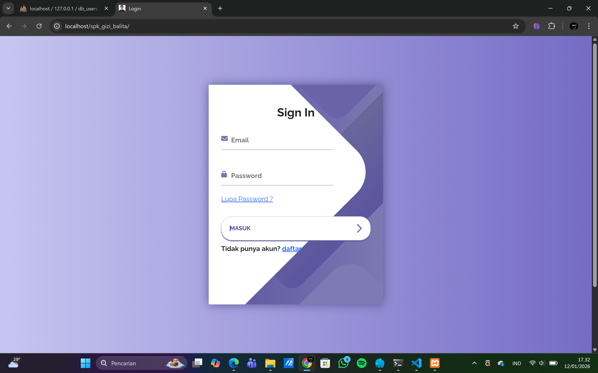
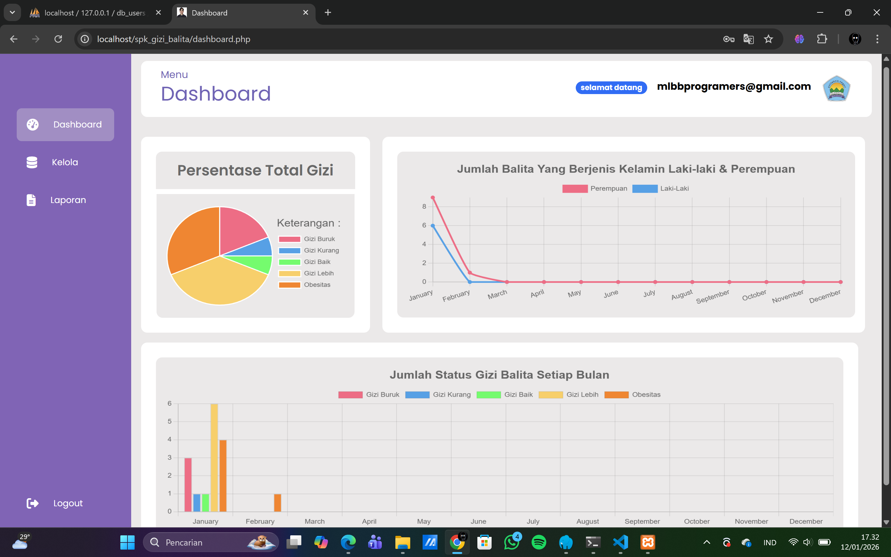
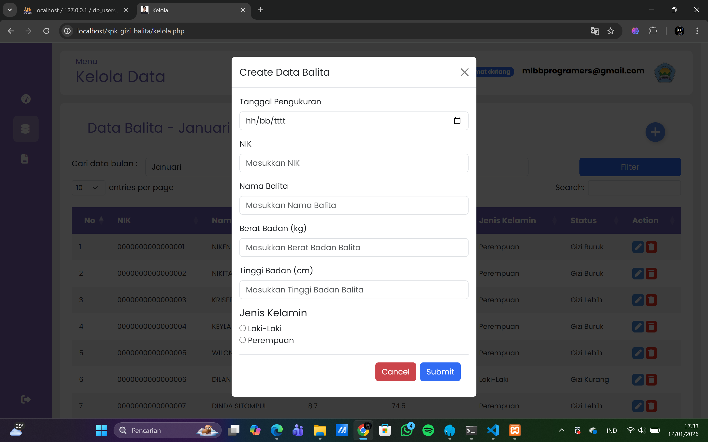
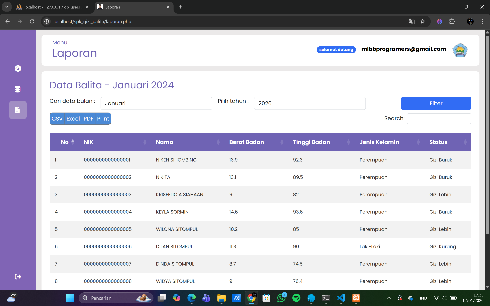

# 👶 Sistem Pengambilan Keputusan (SPK) Status Gizi Balita
### Algoritma K-Means Clustering


Repositori ini berisi aplikasi Sistem Pengambilan Keputusan (SPK) untuk menentukan status gizi balita menggunakan metode **K-Means Clustering**. Aplikasi ini dikembangkan untuk membantu tenaga kesehatan dalam mengelompokkan data balita secara objektif berdasarkan parameter fisik tertentu.

## 📸 Tampilan Aplikasi

| Halaman Login | Dashboard (Visualisasi Data) |
| :---: | :---: |
|  |  |

| Kelola Data Balita | Laporan Hasil Clustering |
| :---: | :---: |
|  |  |

## 🌟 Fitur Utama
- **Clustering Otomatis:** Mengelompokkan data balita ke dalam beberapa cluster (misal: Gizi Buruk, Gizi Kurang, Gizi Baik) berdasarkan perhitungan jarak *Euclidean*.
- **Manajemen Data Balita:** CRUD (Create, Read, Update, Delete) data balita yang akan diproses.
- **Visualisasi Perhitungan:** Menampilkan langkah-langkah iterasi algoritma K-Means, mulai dari penentuan centroid awal hingga hasil konvergensi.
- **Laporan Hasil:** Ringkasan hasil pengelompokan yang dapat digunakan untuk pengambilan kebijakan kesehatan.

## ⚙️ Tech Stack
- **Bahasa Pemrograman:** PHP
- **Database:** MySQL
- **Frontend:** Bootstrap, JavaScript (jQuery), DataTables.
- **Library Pendukung:** Chart.js (untuk visualisasi data).

## 🧮 Cara Kerja Algoritma
Aplikasi ini mengimplementasikan langkah-langkah K-Means sebagai berikut:
1. **Inisialisasi:** Menentukan jumlah cluster ($k$) dan memilih centroid awal secara acak atau manual.
2. **Perhitungan Jarak:** Menghitung jarak antara setiap data balita dengan setiap centroid menggunakan rumus *Euclidean Distance*.
3. **Pengelompokan:** Memasukkan data ke dalam cluster dengan jarak terpendek.
4. **Update Centroid:** Menghitung ulang rata-rata (mean) data dalam setiap cluster untuk menjadi centroid baru.
5. **Iterasi:** Mengulang proses hingga posisi centroid tidak lagi berubah (konvergen).

## 🚀 Instalasi & Penggunaan

### Prasyarat
- XAMPP / Laragon (Web Server Apache & MySQL)
- PHP versi 7.4 ke atas

### Langkah-langkah
1. **Clone Repositori**
   ```bash
    git clone https://github.com/Rei345/SPK-Status-Gizi-Balita.git
   ```
2. **Setup Database**
    - Buat database baru bernama 'db_gizi_balita' (atau sesuaikan dengan file konfigurasi yang diinginkan).
    - Import file .sql yang tersedia di folder root proyek.
3. **Konfigurasi Koneksi**
    - Buka file koneksi database 'koneksi.php'.
    - Sesuaikan database, username, dan password.
4. **Jalankan Aplikasi**
    - Start Apache dan MySQL pada XAMPP.
    - Akses di browser melalui http://localhost/SPK-Status-Gizi-Balita.